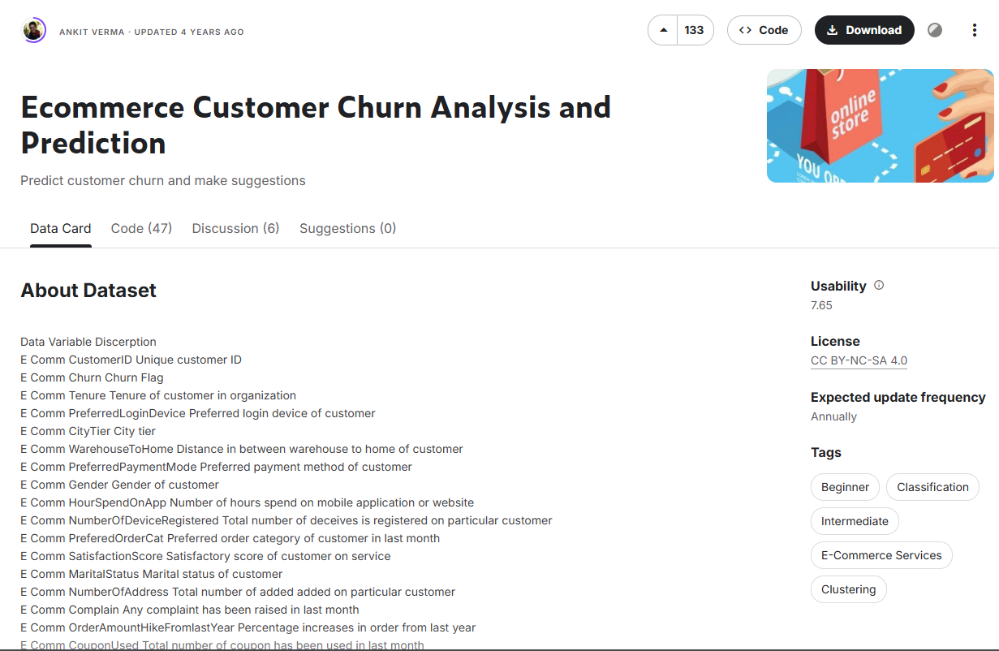
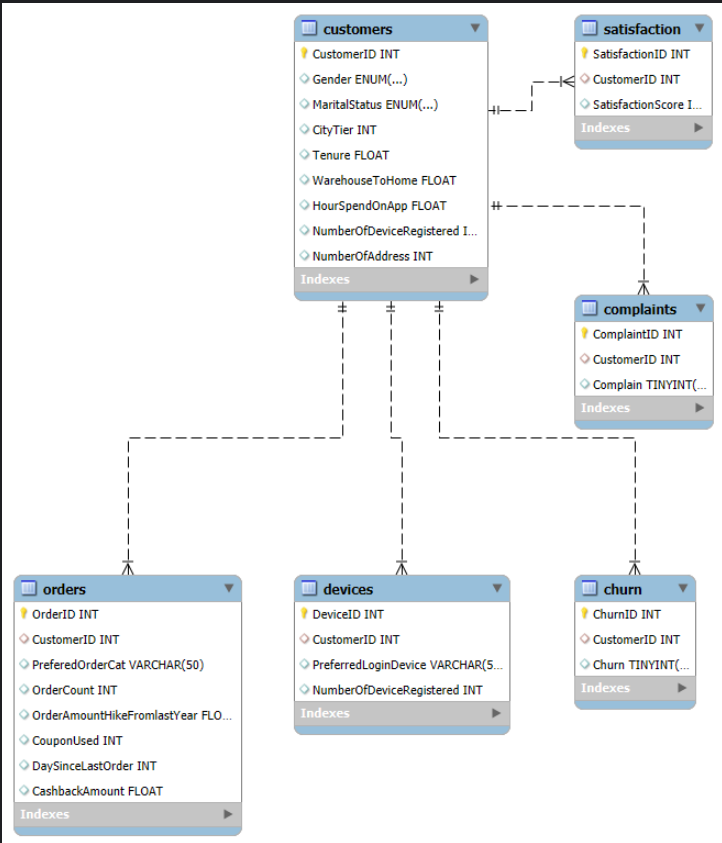
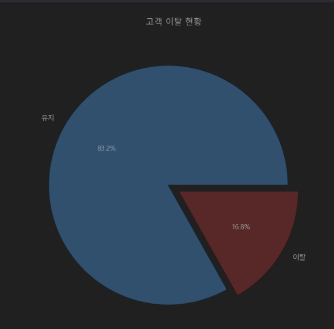
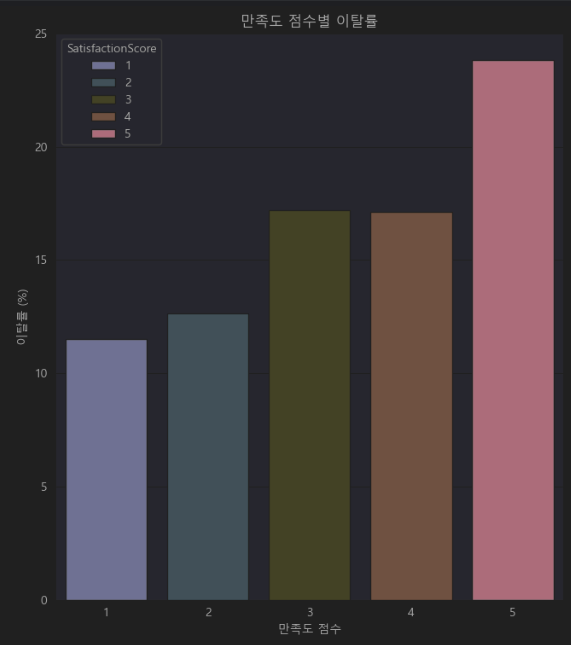

# SKN14-2nd-3Team

---
🗓️ **기간**: 2025.06.04 ~ 2025.06.05

# 0. 팀 소개

---

## 🙋🏻 팀명: 

|  |  |  |  |
|:--------------------------------------------------:|:--------------------------------------------------:|:--------------------------------------------------:|:---------------------------------------------------:|:-----:|
|                        김성민                         |                        정민영                         |                        서은선                         |                         공지환                         | 정유진 |
|  [@jiyun-kang12](https://github.com/jiyun-kang12)  |       [@Gogimin](https://github.com/Gogimin)       |        [@JI0617](https://github.com/JI0617)        |    [@jaehoi-koo](https://github.com/jaehoi-koo)     |


# 1. 프로젝트 개요

---

## >🛒 이커머스 이탈률 예측
최근 이커머스 시장의 경쟁이 치열해지면서, **고객 이탈 방지(Customer Retension)**가 중요한 과제가 되었습니다.  본 프로젝트에서는 이커머스 플랫폼의 고객 데이터를 기반으로, 고객 이탈 여부(Churn)를 사전에 예측하고자 합니다.  이를 위해 고객의 활동 이력, 주문 정보, 디바이스 사용 패턴 등 다양한 데이터를 분석하고, **이탈 가능성이 높은 고객을 초기에 식별할 수 있는 머신러닝 예측 모델**을 개발합니다.  이 프로젝트는 마케팅 전략 수립, 타겟 마케팅, 개인화 서비스 등에 활용될 수 있는 기반 정보를 제공합니다.


**이커머스 이탈률이 높은 이유**

✅ 1. 이커머스 고객 이탈의 구조적 요인

| 원인 | 설명 |
|------|------|
| ❗ 낮은 구매 빈도(OrderCount) | 고객당 평균 주문 횟수는 약 **3회**로, 전체적으로 낮은 활동 수준을 보임. 반복 구매 유도가 부족하면 이탈로 이어질 가능성 있음 |
| ❗ 짧은 앱 사용 시간(HourSpendOnApp) | 하루 평균 앱 사용 시간은 **2.9시간**으로 짧고, **0시간 사용자도 존재**함 → 서비스 이용 자체에 흥미를 못 느끼는 사용자 존재 가능성 |
| ❗ 마지막 주문 이후 긴 공백(DaySinceLastOrder) | 평균 **4.5일** 이상 지난 사용자가 다수 존재, 특히 **46일까지 미구매 고객도 존재** → 이탈 가능성 매우 높음 |
| ❗ 짧은 고객 유지 기간(Tenure) | 가입 후 이용 기간이 **평균 10개월**, **0개월(신규 고객)** 도 존재함 → onboarding 실패 시 조기 이탈 위험 있음 |


✅ 2. 고객 개인 특성 요인

| 요인 | 설명 |
|------|------|
| 🔍 시간 제약 | **직장인 중심의 고객층**은 앱 사용 시간이 짧고, 주문 빈도도 낮아 구매 여유가 부족함 |
| 🔍 디지털 사용 습관 차이 | 모바일/앱 기반 구매에 익숙하지 않은 고객층은 서비스 적응에 실패하거나 빠르게 이탈함 |
| 🔍 구매 목적의 불명확성 | 일회성 할인/이벤트로 유입된 고객은 **명확한 구매 목표 없이 이용** 후 이탈하는 경향이 있음 |
| 🔍 소비 성향 차이 | 충성도 높은 고객과 달리, **가격 민감형·체험 위주 고객**은 반복 구매로 이어지지 않음 |

---

### 🎯  **프로젝트 목표**

- 이커머스 고객의 행동 이력을 바탕으로 **이탈 가능성을 정량적으로 예측하고**,  
- 실제 마케팅/운영 전략에 **즉시 활용 가능한 인사이트와 모델을 제공**하는 것이 본 프로젝트의 목표입니다.

### **프로젝트 기획**
**이커머스 고객 이탈 예측을 위한 최적의 머신러닝 모델 구축**  
(데이터 전처리 → 피처 엔지니어링 → 모델 학습 및 하이퍼파라미터 튜닝 → 최종 모델 평가)


# 2. 📊 데이터 수집 및 선정
---

1. **데이터 개요**

**: E-commerce Customer Dataset**

본 프로젝트에 사용된 데이터는 이커머스 플랫폼의 고객 행동 및 구매 이력을 기반으로 구성된 데이터셋입니다.  
고객의 **이용 기간, 주문 횟수, 앱 사용 시간, 성별, 결제 수단, 디바이스 유형** 등 다양한 피처를 통해  
이탈 가능성을 예측하고, 행동 패턴에 따라 고객을 분류합니다.




**ERD**



**✅ 최종 선정된 데이터셋 구성**

| **변수명**                      | **변수 설명**                                       |
|-------------------------------|----------------------------------------------------|
| `churn`                       | 고객 이탈 여부 (0: 유지, 1: 이탈)                   |
| `Tenure`                      | 고객의 e커머스 이용 기간 (월)                      |
| `CityTier`                    | 도시 규모 등급 (1: 대도시, 2: 중도시 등)           |
| `WarehouseToHome`            | 창고 → 고객까지의 배송 소요 시간                   |
| `HourSpendOnApp`             | 하루 평균 모바일 앱 사용 시간                      |
| `NumberOfDeviceRegistered`   | 등록된 로그인 기기 수                              |
| `SatisfactionScore`          | 고객이 평가한 서비스 만족도 점수 (1~5점)           |
| `NumberOfAddress`            | 등록된 배송 주소 수                                |
| `Complain`                   | 지난달 컴플레인 제기 여부 (0: 없음, 1: 있음)       |
| `OrderAmountHikeFromlastYear`| 전년 대비 주문 증가율 (%)                          |
| `CouponUsed`                 | 지난달 사용한 쿠폰 수                              |
| `OrderCount`                 | 지난달 주문 건수                                   |
| `DaySinceLastOrder`          | 마지막 주문 이후 경과 일수                          |
| `CashbackAmount`             | 지난달 받은 캐시백 금액                            |
| `NoLastYearPurchase`         | 작년에 구매 이력이 없는 고객 (1: 없음, 0: 있음)    |


# 3. 탐색적 데이터 분석(EDA)

---
### 1. 데이터 전처리🧹

🧩 **데이터 병합**

- 🔹 CustomerID 컬럼 삭제
    
- 🔹 Churn 컬럼 변주형으로 변경

- 🔹 결측치 처리
    - 수치형 > 평균값 대체
    - 범주형 > 최빈값 대체 (해당 데이터 속 범주형 데이터에는 결측치가 존재하지 않음)
  
  범주형 변수 정제

- `PreferredLoginDevice` 컬럼에서 일부 항목명을 간결하게 정제하여 일관성 확보:

| 원래 값         | 변경 후 값 |
|------------------|-------------|
| `Mobile Phone`   | `Mobile`    |

 🧨'Mobile Phone' 값을 'Mobile'로 간소화
df['PreferredLoginDevice'] = df['PreferredLoginDevice'].replace({'Mobile Phone': 'Mobile'})


**1️⃣ 결측치 처리**

결측값이 존재하는 컬럼에 대해 다음과 같은 방식으로 처리함.

- `Tenure`, `WarehouseToHome`, `HourSpendOnApp`, `OrderAmountHikeFromlastYear`, `CouponUsed`, `OrderCount`, `DaySinceLastOrder`

>💡**평균값으로 대체한 이유**
> - 데이터 손실 최소화
> - 결측 비율이 낮음
> - 수치형 변수에 적합한 방법
> - 모델 학습에 유리한 구조 유지

**2️⃣️범주형 변수 인코딩**

모델 학습을 위해 주요 범주형 컬럼들을 수치형 변수로 인코딩하여 처리함.  
단순 One-Hot Encoding이 아닌, 의미 있는 순서를 고려한 서열화 또는 대표값으로 변환하는 방식 적용:

- `PreferredLoginDevice`: 기기 유형에 따라 명확한 우선순위가 없어 → **One-Hot Encoding 예정 또는 필요 시 Label Encoding**
  
- `PreferredPaymentMode`: 결제 수단은 비서열형 범주로 판단 → **Label Encoding 진행**
  
- `PreferedOrderCat`: 주문 선호 카테고리는 카테고리 수가 많지 않아 → **Label Encoding 처리**
  
> 모든 범주형 변수는 결측치가 없었기 때문에 인코딩 전 별도 결측치 보정은 불필요함.
 

**#️⃣ 🎯 Target 변수 생성**


이탈 예측을 위한 타겟 변수(`target`)는 기존의 `Churn` 컬럼을 기반으로 다음과 같이 정의함:

| Churn 값 | 설명                             | 이탈 여부 | target 값 |
|----------|----------------------------------|-----------|------------|
| `0`      | 서비스를 지속 이용 중인 고객     | 이탈 ❌   | `0`        |
| `1`      | 서비스를 중단한 고객 (이탈자)    | 이탈 ⭕   | `1`        |

- `Churn` 컬럼 자체가 고객의 이탈 여부를 명확히 나타내므로, 별도의 가공 없이 그대로 `target` 변수로 활용함
- 모델 학습 시 변수 명확성을 높이기 위해 `target`이라는 이름으로 재명명
- 이후 혼동 방지를 위해 기존 `Churn` 컬럼은 제거함


### 타겟 변수 생성 및 기존 컬럼 제거
```python
df['target'] = df['Churn']
df.drop(columns=['Churn'], inplace=True)
```

### 타겟 변수 생성
```python
df['target'] = df['Churn']
df = df.drop(columns=['Churn'])
```


**2️⃣ 결측치 처리 방식**

### 🛠️ 결측치 처리 방식

본 프로젝트에서는 결측치를 제거하지 않고 **값을 대체하는 방식**으로 전처리를 수행함 
- **수치형 변수**의 경우, 전체 평균값을 계산하여 해당 결측값을 평균으로 대체함  
  → 이는 데이터의 연속성을 유지하면서 전체 분포에 영향을 최소화할 수 있는 전략

- **범주형 변수**는 가장 많이 등장한 값(최빈값, Mode)으로 결측치를 채움  
  → 범주형 데이터의 대표성을 유지하면서, 데이터 왜곡을 줄이기 위한 방법

이와 같은 결측치 처리 방식은  
👉 **데이터 손실을 최소화**하고  
👉 모델 학습 시 **안정적인 입력 구조를 유지**하는 목적


### 2. 데이터 시각화

### 📊 시각화 기반 주요 인사이트 분석

고객 이탈 예측 프로젝트에서 다양한 고객 특성에 따른 이탈 패턴을 시각적으로 분석하여  
비즈니스 관점에서 유의미한 인사이트를 도출함

---

#### 1️⃣ 고객 이탈 분포 (Pie Chart)

- 유지 고객 비율: 약 **83.0%**  
- 이탈 고객 비율: 약 **17.0%**

👉 전체 고객 중 이탈률은 **상대적으로 낮지만 무시할 수 없는 수준**으로,  
핵심 고객 이탈 방지 전략이 필요


---

#### 2️⃣ 만족도 점수별 이탈률 (Bar Plot)

- 만족도 점수가 낮을수록 이탈률이 급격히 상승  
- 특히 점수 **1~2점대는 이탈률 50% 이상**

👉 **서비스 만족도 개선**이 이탈 방지의 핵심 요인임

---

#### 3️⃣ 도시 등급(CityTier)별 이탈률

- **소도시 고객**일수록 이탈률이 높음  
- 대도시 고객은 상대적으로 이탈률이 낮음

👉 **지역 기반 차별화 전략**이 필요하며,  
중소 도시 고객 대상 마케팅 강화가 효과적일 수 있음

---

#### 4️⃣ 앱 사용시간 vs 주문 수 (산점도)

- 앱 사용시간과 주문 수는 양의 상관관계  
- 유지 고객은 전반적으로 앱을 더 오래 사용하며 더 많이 구매

👉 앱 사용량이 고객 충성도 지표로 활용 가능하며,  
**앱 활용을 유도하는 UX 전략이 필요**

---

#### 5️⃣ 불만 제기 여부별 이탈률

- 불만 제기 고객의 이탈률이 **2배 이상 높음**  
- 컴플레인 여부는 강력한 이탈 예측 지표

👉 **CS 응답 품질 및 피드백 처리 속도 개선** 필요  
불만 제기 고객은 빠른 케어가 필수

---

#### 6️⃣ 이탈 여부별 주문 금액 증가율 (Box Plot)

- 이탈 고객은 전년 대비 주문 증가율이 낮고, 분포도 넓음  
- 유지 고객은 안정적인 구매 성장을 보임

👉 **이탈 고객의 구매 상승 곡선을 조기에 멈추게 하지 않는 전략**이 중요

---

### 🔍 추가 분석 항목 (미출력 or 선택 출력)

> 🔸 선호 결제 수단별 고객 비율  
> 🔸 선호 주문 카테고리 분포  
> 🔸 등록된 기기 수에 따른 이탈률 변화

👉 이들 항목은 고객의 구매 성향과 이탈 간접 요인 분석에 활용될 수 있으며,  
**Segment 마케팅 설계 및 개인화 추천의 기초 데이터**로 사용 가능함

---

📌 **요약**  
이러한 시각화 분석을 통해 고객의 행동 패턴과 이탈 특성을 정량적으로 이해하고,  
**데이터 기반의 정밀한 타겟 마케팅 및 이탈 방지 전략 수립이 가능**해짐


# 4. 인공지능 학습 결과서
### 📊 1. 사용한 예측 모델
| 모델 종류                                 | 설명                                  |
|---------------------------------------|-------------------------------------|
| 🌲 **Random Forest (RF)**             | 여러 개의 트리를 결합한 앙상블 모델                |
| 🚀 **XGBoost**                        | 빠르고 성능 좋은 그래디언트 부스팅 모델              |
| 📍 **KNeighborsClassifier (KNC)**     | 다수결로 분류하는 거리 기반 모델                  |
| 🧭 **Support Vector Classifier(SVC)** | 마진이 초대가 되도록 클래스를 나누는 분류 모델          |
| 🐱 **HistGradient**                   | 히스토그램으로 연산 속도를 높인 그래디언트 부스팅 모델      |
| ⚡ **Stacking**                        | 여러 모델의 예측 결과를 조합해 최종 예측을 만드는 앙상블 기법 |
| 🧠 **Voting**                         | 다수결 결과로 최종 클래스를 결정하는 방식             |
| 🌕 **LightGBM**                       | 대용량 데이터에 효율적인 gradient boosting 모델  |
| 📈 **ㅎGradientBoosting**              | 약한 모델을 반복 학습해 점점 성능을 높이는 부스팅 모델     |

#### 📊 1-2. 모델 성능 비교
| 📌 지표 기준         | 설명                                                 |
|----------------------|------------------------------------------------------|
| ✅ **Accuracy**       | 전체 분류 정확도 (모든 예측 중 정답 비율)                  |
| 🎯 **Recall**        | 실제 이탈자를 얼마나 잘 잡았는가 (FN ↓)                    |
| ⚠️ **Precision**     | 예측된 이탈자 중 실제로 이탈한 비율                        |
| 🔁 **F1-score**       | Precision과 Recall의 조화 평균. 두 지표 간 **균형**을 평가할 때 사용 |


### 🏆 2. 최종 선정 모델: Gradient Boosting (Threshold 최적화 버전)

GradientBoostingClassifier를 기반으로 한 모델을 사용하여 고객 이탈 여부를 예측하였으며, **기본 예측 임계값(0.5)** 대신 **threshold=0.134**로 조정하여 성능을 극대화했습니다.  


📌 **선정 이유**
- 기본 모델 대비 **Recall(재현율)과 F1-Score가 높은 성능**을 기록
- 특히 **이탈 고객(클래스 1)에 대한 Recall을 1.00으로 향상**시켜, 중요한 양성 클래스 예측을 극대화
- 전체 Accuracy 또한 **0.9902로 매우 우수한 성능**

📈 **최종 모델 성능 요약 (Threshold=0.134)**

| 지표 | 클래스 0 | 클래스 1 | 평균 (Macro) |
|------|----------|----------|---------------|
| Precision | 1.00 | 0.95 | 0.97 |
| Recall    | 0.99 | 1.00 | 0.99 |
| F1-score  | 0.99 | 0.97 | 0.98 |
| Accuracy  | -    | -    | **0.9902** |

> 예측 확률을 기반으로 Threshold를 세밀하게 조정함으로써,  
> **이탈 고객을 더 놓치지 않는 방향으로 모델을 개선**.

# 5. RFM 분석 기반 고객 세분화
이탈 예측 모델과 함께, 고객의 구매 행동을 바탕으로 한 **RFM 분석**도 수행함
RFM 분석은 고객을 **Recency(📅 최근성), Frequency(🔁 구매 빈도), Monetary(💰 구매 금액)** 기준으로  
가치 기반 세그먼트로 분류하여 **정밀한 마케팅 전략 수립**에 활용됨
---
#### 📐 RFM 항목 정의
- Recency: 최근 구매일기준
- Frequency: 고객별 구매건수
- Monetary Value: 총 구매가격(단위가격 * 수량)
---

#### 🎯 분석 목적
- 고객의 **행동 가치 기반 분류**를 통해,이탈 예측 외에도 **충성도와 구매력 고려**
- **이탈 확률 + RFM 세그먼트** 조합으로 **더 정밀한 고객 대응 전략 수립 가능**


#### 📦 클러스터 기반 고객 페르소나 분석 및 마케팅 전략
RFA 분석과 클러스터링을 통해 고객을 4개의 유형으로 분류하고,  
각 그룹에 맞는 페르소나 및 대응 전략을 수립함

#### 🟥 **Cluster 0: 이탈 위험 고객** (1,315명)

- **📌 특성**  
  - 최근 구매: 2.8일 전  
  - 구매 빈도: 매우 낮음 (1.79회)  
  - 평균 구매액: $12,900

- **🧑 페르소나**  
  최근에 첫 구매를 했지만 이후 활동이 없는 **신규 또는 일회성 구매자**

- **🎯 마케팅 전략**
  - 구매 직후 만족도 조사 및 피드백 수집  
  - 개인화된 상품 추천을 통한 재구매 유도  
  - 신규 고객 온보딩 프로그램 강화  

---
여기 클러스터링 다시 해야 됨 
#### 🟦 **Cluster 1: VIP 고객** (1,125명)

- **📌 특성**  
  - 구매 간격: 길음 (16.97일)  
  - 구매 빈도: 높음 (3.29회)  
  - 평균 구매액: **최고** 수준 ($20,978)

- **🧑 페르소나**  
  구매력과 충성도를 동시에 가진 **프리미엄 고객층**

- **🎯 마케팅 전략**
  - VIP 전용 혜택 및 프리미엄 서비스 제공  
  - 개인 맞춤형 컨시어지 서비스  
  - 신상품 우선 공개 및 독점 이벤트 초대  

---

#### 🟩 **Cluster 2: 충성 고객** (2,570명, 가장 큰 규모)

- **📌 특성**  
  - 구매 간격: 적당 (4.51일)  
  - 구매 빈도: 보통 (2.79회)  
  - 평균 구매액: $16,105

- **🧑 페르소나**  
  꾸준히 구매하는 안정적인 **핵심 고객층**

- **🎯 마케팅 전략**
  - 정기 할인 및 프로모션 제공  
  - 로열티 프로그램으로 장기 유지  
  - 교차 판매 및 상향 판매 기회 확보  

---

#### 🟨 **Cluster 3: 고가치 신규 고객** (620명)

- **📌 특성**  
  - 구매 간격: 보통 (6.86일)  
  - 구매 빈도: 매우 높음 (4.74회)  
  - 평균 구매액: **최고** 수준 ($28,741)

- **🧑 페르소나**  
  활발히 구매하고 지출도 큰 **프리미엄 신규 고객**

- **🎯 마케팅 전략**
  - 최우선 타깃으로 지정하여 집중 관리  
  - 프리미엄 제품 중심의 맞춤 마케팅  
  - 장기 고객화를 위한 특별 관리 프로그램 운영  

---

### 🚦 마케팅 우선순위 제안

| 우선순위 | 클러스터 | 전략 키워드 |
|----------|----------|-------------|
| 🥇 최우선 | Cluster 3 (고가치 신규) | 집중 유치 및 관계 강화 |
| 🥈 중점 유지 | Cluster 1 (VIP) | 프리미엄 혜택 강화 |
| 🥉 안정 관리 | Cluster 2 (충성 고객) | 관계 유지 및 확대 |
| 🛠 재활성화 | Cluster 0 (이탈 위험) | 재접촉 및 이탈 방지 |

---

📌 **결론**  
클러스터별로 고객의 성향과 행동 패턴을 고려한 차별화된 전략을 실행함으로써  
**고객 생애 가치(LTV)를 극대화하고, 효율적인 마케팅 자원 배분이 가능**해짐


# 6. Streamlit 화면 구현
### ✅대시보드 홈 페이지 (메인)


### ✅학습자 이탈 예측 페이지 (메인)


### ✅학습자 이탈 예측 페이지 (예측 후)


### ✅모델 성능 평가 페이지 (메인)


### ✅모델 성능 평가 페이지 (각 모델 성능 시각화 적용시)


# 6. 한 줄 회고
> 📌 **정민영**: 
> 📌 **정유진**: 
> 📌 **서은선**: 
> 📌 **김성민**: 